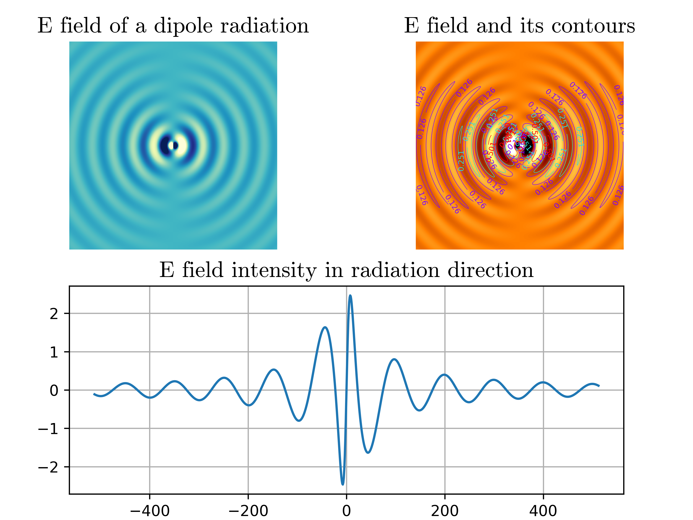
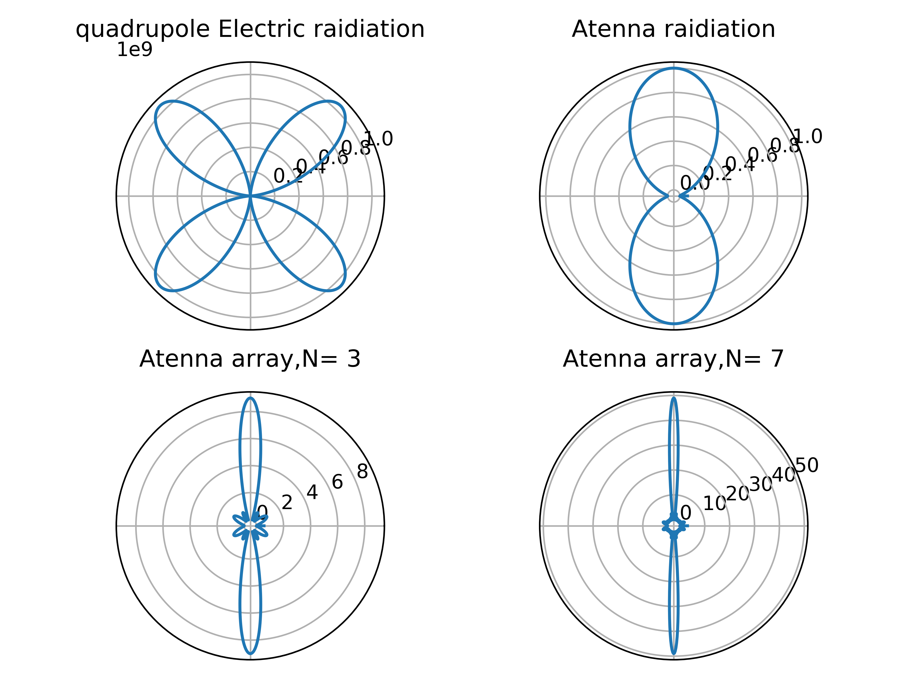

# Electric Dynamics coding Assignments

## Chapter 2
### This is a code assignment for Electric Dynamics Chapter2 2019,BNU. 

1.run [ED_Chapter2_code.py](ED_Chapter2_code.py), which produces a 2X2 figure of electric potential distribution of full field and dipole moment.

2.run [ED_Chapter2_code_plus.py](ED_Chapter2_code_plus.py), which produces a series of full field electric potential distribution maps.

#### Please refer to "Electrodynamics" by China Higher Education Press for detailed answers.

## Chapter 4

### A simulation of electric field intensity map of a rectangluar cavity.

### This is a code assignment for Electric Dynamics Chapter4 2019,BNU. 

1. run [ED_Chapter4.py](ED_Chapter4.py) to creat a elctric field intensity map of a rectangluar cavity.

elctric field intensity map:

#### Please refer to "Electrodynamics"Page.130-131 by China Higher Education Press for detailed answers.

## Chapter5
### A series of electrimagnetic field intensity simulations of electric dipole, electric quadrupole and magnetic dipole radiation, and the energy flux density simulation of atenna and atenna arrays.

### This is a code assignment for Electric Dynamics Chapter5 2019,BNU. 

1. run [Edipole_map.py](Edipole_map.py) to creat a elctric field intensity map of a electric dipole radiation

2. run [Edipole_video.py](Edipole_video.py), which produces a series of full field electric field intensity  distribution of a electric dipole radiation maps.

<!-- 3. run [video_maker.py](video_maker.py), which produce a video consists of full field electric field intensity distribution maps of a dipole radiation produced by Edipole_video.py. -->

3. run [video_editor.py](video_editor.py), which  can produce a video consists of full field electric field intensity distribution maps of a dipole radiation produced by Edipole_video.py and edit the video, like adding calling card and BGM, etc..

4. run [Atenas.py](Atenas.py),which can create the energy flux density distribution in directions for electic quadrupole radiation and atennas array.

#### electric dipole radiation:

#### electric quadrupole radiation and Atennas array radiation:

#### electric dipole radiation sketch video：

#### Please refer to "Electrodynamics"Page.163-165 & 171-175 by China Higher Education Press for detailed answers.

